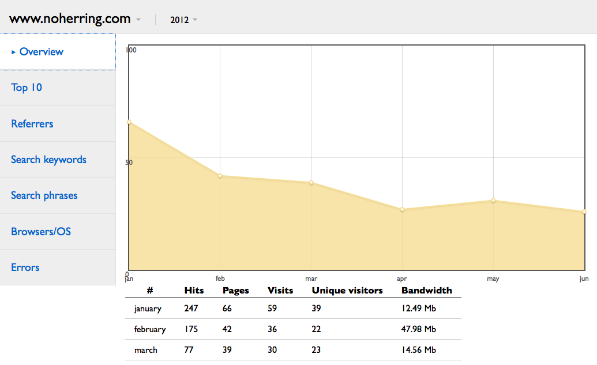
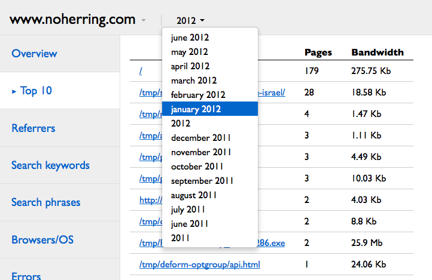

AWStatic is a front-end for `AWStats <http://awstats.sourceforge.net/>`_:
it reads AWStats data files and produces a static HTML file that can
be accessed offline or served by any HTTP server (without CGI
support).

The generated report heavily uses JavaScript and cannot be properly
displayed if JavaScript support is disabled in your browser.

For now, AWStatic is not much more than a small exercise in building a
client-side application. It is far from being as complete as the
default front-end shipped with AWStats (although it probably is a bit
more elegant). It currently includes:

- a full statistics overview with hits, pages, visits, visitors and
  bandwidth by day, by month and by year;

- top 10 pages (hits and bandwidth) by month and by year;

- top 10 files (hits and bandwidth) by month and by year;

- top 30 referrers (pages and hits) by month and by year;

- top 30 search keywords by month and by year;

- top 30 search phrases by month and by year.

A future version may include diagrams that show the repartition of
operating systems and browsers.

Screenshots
===========

Installation
============

As usual, installing in a virtual environment is highly recommended.
Then you may install with ``easy_install`` or ``pip``:

.. code-block:: bash

   $ easy_install awstatic

or:

.. code-block:: bash

   $ pip install awstatic

How to use AWStatic
===================

Once installed, AWStatic provides an ``awstatic`` executable:

.. code-block:: bash

   $ awstatic --help
   usage: awstatic [-h] [-v] [CONFIG_FILE]

   positional arguments:
     CONFIG_FILE    The configuration file to use. Default is "./awstatic.ini".

   optional arguments:
     -h, --help     show this help message and exit
     -v, --version  show program's version number and exit

As shown in the help message, AWStatic requires a configuration
file. Here is an example:

.. code-block:: ini

   [awstatic]
   awstats_dir = /var/lib/awstats
   out_dir = ./out
   sites = www.example.com=http://example.com
           www.anotherexample.com=http://another.example.com
   pdb = true

   [logger]
   level = debug
   path = -

There are two sections: ``awstatic`` and ``logger``. In the
``awstatic`` section, you may use the following options:

``awstats_dir``
    Directory where raw AWStats data reside. On Debian, it is
    ``/var/lib/awstats`` by default. If you are not sure where those
    files are located on your system, look for files named
    ``awstats.*.txt``.

``out_dir``
    Directory where AWStatic will write its report. 

``sites``
    A list of sites to include in the report. Sites are separated by
    spaces or newline characters. Each site is defined by an
    identifier that has been used to generate AWStats data files,
    followed by an equal sign (``=``), followed by the root URL of the
    site (which will be used by AWStatic to provide fully qualified
    URLs in the report).

    If multiple sites are provided, the report will include data for
    all sites and the user will have to select the site she is
    interested in (see the screenshot above). Sites are supposed to be
    independant and their data are **not** merged.

``pdb``
    A debugging option, useful only if you feel adventurous and would
    like to jump in the code when an exception occurs. Default: false.

In the ``logger`` section, you may use the following options:

``level``
    The level at which you want to debug. May be ``debug``, ``info``,
    ``warning`` or ``error``. Default: ``warning``.

``path``
    Path to the log file, or a single dash (``-``) if logs should be
    written to the standard error stream. If given a path, it must be
    an absolute path. Default: ``-``.

Development
===========

AWStatic is hosted on GitHub at `<https://github.com/dbaty/AWStatic>`_.
Feel free to provide feedback and report issues or patches there.

AWStatic comes with automated tests that may be run with ``tox`` (that
uses both Python 2.7 and Python 3.2) or ``make test`` (that uses your
default ``python`` executable). The latter also opens
``awstatic/tests/js/tests.html`` that contains a test suite for the
JavaScript code.

Credits
=======

AWStatic includes the following libraries:

- `jQuery <http://jquery.com>`_, available under both the GPL and MIT license;

- `Flot <http://code.google.com/p/flot>`_, available under the MIT license;

- `Handlebars <http://handlebarsjs.com>`_, available under the MIT license.

It also includes an extract of `Bootstrap
<http://twitter.github.com/bootstrap>`_, available under the Apache
License v2.0.

The loading icon has been generated by `<http://www.ajaxload.info>`_.

License
=======

AWStatic is written by Damien Baty and is licensed under the 3-clause
BSD license, a copy of which is included in the source and reproduced
below:

.. include:: LICENSE.txt
   :literal: